# jevify

jevify gives command-line tools an understanding of meaning, using [Jev](https://docs.typesafe.ai) from [TypeSafe AI](https://typesafe.ai).

[](https://github.com/tpellet/jevify/actions/workflows/ci.yml)
[](https://crates.io/crates/jevify)
[](LICENSE)

```text
                         output side
command output ──┬── jevify why              → a cause with numbered context
                 ├── jevify pick '…'         → one record
                 ├── jevify filter '…'       → matching records
                 └── jevify is '…'           → an exit code
```

It selects existing text, never invents an answer, and says when nothing fits. Your description
and the record need no word in common.

## Thirty seconds

Install with Rust 1.87 or newer, on macOS or Linux:

```sh
cargo install jevify --locked
printf 'build started\nerror: connection timed out\nbuild stopped\n' | jevify filter 'reports a network failure'
printf 'All tests passed.\n' | jevify is 'the tests passed' && printf 'ready\n'
```

No key or account is needed: [classifier.dev](https://classifier.dev) serves the free backend.
A TypeSafe key selects your own TypeSafe quota: `export TYPESAFE_API_KEY_FILE=/path/to/key`.
`jevify health` names the backend and checks the connection. [Getting started](docs/guide/getting-started.md)
covers installation and backend settings.

## The output side

| You want | Verb | Classical twin | Returns |
|:---|:---|:---|:---|
| the line that explains a failure | `why` | — | numbered lines with context |
| one record out of many | `pick 'description'` | `fzf --filter` | an input record |
| only the records that matter | `filter 'statement'` | `grep` | a subset of the input |
| a decision to branch on | `is 'statement'` | `test` | an exit code |

Cheap tools narrow the input first. `pick` and `filter` preserve selected records byte for byte
and in input order, so ordinary pipes keep working:

```sh
gh pr list --json number,title | jq -c '.[]' | jevify filter 'touches the installer' | jq -r .number
gh issue list | jevify filter 'reports a crash' | cut -f1
grep -i 'error' build.log | jevify pick 'the network failure'
fd -0 -e json | jevify filter -0 --files 'a test fixture'
jevify filter 'reports a failure' < build.log | head -n 10
grep -n -C2 -F -f <(jevify filter 'reports a failure' < build.log) build.log
```

A record is a line. `--para` selects paragraphs; `-0` selects NUL-separated records. These
options belong to `pick` and `filter`. `why` takes none of them: pipe a log with `2>&1` and
it prints a cause with its line number and context. `-C 5` widens that context.

`filter -v` inverts the statement; `-c` prints the count. Unsure records stay unless
`--strict` drops them. `--verbose` prints diagnostics and has no short flag.

`--files` is a boolean on `pick` and `filter`: paths come from stdin. For example,
`git ls-files | jevify pick --files 'where man pages are parsed'` ranks paths, then reads
excerpts of the finalists. Hidden and secret-looking paths remain candidates but receive no
excerpt; symlink files receive no excerpt either. The status reports `excerpts withheld: N`.

Only `why` and `filter` save their full raw input. The stderr status names the way back:
`jevify why: full output: PATH` or
`jevify filter: kept N of M, U unsure, full output: PATH`.
`--no-save` disables this store; a skipped or failed save reports
`full output: not saved (REASON)` and sets `data.complete=false`. Saved inputs include secrets
and are never pruned. [Privacy](PRIVACY.md) names the directory and both stores.

One `is` statement prints nothing. Several print `VERDICT<TAB>STATEMENT` lines:

```sh
printf 'Please refund order 42.\n' | jevify is 'asks for a refund' 'mentions an order'
jevify is 'asks for a refund' --context mail.txt
```

The verdicts are `yes`, `no` or `unsure`. `is` exits 0 when all are yes, 1 when any is no,
and 3 otherwise. It abstains before a request if the whole context exceeds its evidence budget.

## Exit codes

Write the condition so that yes means act. `&&` acts only on exit 0; a no, an unsure answer,
and a network failure all stop that chain. Use `case` when those outcomes need different handling.

| Code | Meaning |
|---:|:---|
| 0 | yes, found, or successful operation |
| 1 | `is`: at least one no; `filter`: kept none |
| 2 | usage error |
| 3 | nothing fits, or unsure; `filter`: every record unsure |
| 4 | backend unavailable or quota exhausted |
| 5 | TypeSafe key missing or rejected |
| 6 | empty, oversized or unreadable input |
| 7 | reserved |
| 130 | declined at `add` confirmation |

Do not pass an unchecked `pick` substitution straight into another command: abstention prints
nothing, and the shell can turn it into an empty argument. Check the selection's exit code first.

## For agents

```sh
jevify capabilities --json
jevify init agents
jevify robot-docs
```

`capabilities` is the source of truth for commands, flags, data fields and limits. `init agents`
prints a block of at most 25 lines for an agent instruction file. Every command accepts `--json`
(alias `--robot`) for one envelope, including usage errors:

```text
{ok, command, version, exit_code, data, meta, error{kind, message, hint, example} | null}
```

`meta.model` is a string, with several answering models joined by `", "`. Non-UTF-8 records
use `text`, `lossy: true` and `ordinal` in machine output. See the [agent contract](docs/ROBOT_MODE.md).

The [agent skill](plugins/jevify/skills/jevify/SKILL.md) teaches when to use each verb. For Claude
Code, install the `tpellet/jevify` marketplace and `jevify@jevify` plugin. For Codex, place the
skill directory in `~/.agents/skills/`. Output verbs start no user command; the caller's
permissions govern staging with `add` and moving files with `sort`.

## What it is not

jevify does not write commands, flags, messages or file names. It does not count, calculate,
compare dates or judge quality; use code for those jobs. It is not a security gate: text under
judgment can contain instructions that influence the model. Scores require calibration evidence
for the particular backend and task.

## add, sort, route

`add` scores unstaged hunks of tracked files against a topic. `--dry-run` stages nothing;
`--yes` stages qualifying hunks without asking. It changes only the index and never commits.

```sh
jevify add --dry-run 'the token expiry fix'
```

`sort` proposes a home among existing folders. It moves files only with `--apply`; the resulting
JSONL journal supports `--undo`. Atomic no-replace moves preserve occupied destinations. Source
symlink entries are skipped, one volume is required, and concurrent source replacement is unsupported.

```sh
jevify sort ~/Downloads
```

`route` prints an installed tool with its summary and synopsis. It starts no user command and
supplies no arguments. It helps with the long tail of a large PATH.

```sh
jevify route 'keep my mac awake for an hour'
eval "$(jevify init zsh)"
, "what's using port 8080"
```

The alias and opt-in command-not-found hook both call `route`.



## Privacy and limits

Requests go to the configured backend. Secret masking is best effort; file paths themselves
can disclose information. The answer cache uses redacted requests and expires after seven days
(`--no-cache`). Saved inputs are separate, raw and never pruned (`--no-save`).
[PRIVACY.md](PRIVACY.md) lists the data sent per verb.

`pick` and `filter` accept at most 20,000 distinct records, within the 64 MiB input limit.
`filter` batches up to 1,000 records per request on classifier.dev and 20 on TypeSafe. Only the
classifier backend judges records independently; TypeSafe records share a request state.
A `rate_limit_day` HTTP 429 exits 4 with `daily quota of the free backend reached`, without retry.

Selection uses at most two rounds. Long lists and clipped evidence can hide a relevant candidate;
`why` reports `considered` and `total`, and `filter` retains unsure records. `p` is a backend score,
not a promise of correctness. [How it works and measurements](docs/guide/how-it-works.md),
[verbs](docs/guide/verbs.md), [configuration](docs/guide/configuration.md), and the
[FAQ](docs/guide/faq.md) give the details.

## Credits and license

Powered by Jev from TypeSafe AI, with keyless access through classifier.dev. Development tooling
includes Jeffrey Emanuel's [Agent Mail](https://github.com/Dicklesworthstone/mcp_agent_mail)
and [beads](https://github.com/Dicklesworthstone/beads_rust).

MIT.
