# jevify

Find the thing you can describe but cannot name.

You know what a commit did, not its hash. You know the error is in the build log, not which of
the 1,812 lines it is. jevify reads a list you already have: the lines of a log, the commits of
a repository, the files of a directory, the tools on your PATH. It prints the one you asked
for. It points at what is already there, so every value it prints existed before the question.
When nothing fits, it says so and stops.

[](https://github.com/tpellet/jevify/actions/workflows/ci.yml)
[](https://crates.io/crates/jevify)
[](LICENSE)

The examples run on the fixtures in [docs/demo](docs/demo) and on this repository's own history;
`bash docs/demo/examples.sh` runs them all.

## Find the error in a failed build

Your build printed 1,812 lines and stopped. 300 of them are warnings. `why` reads the whole log
and prints the line that explains the failure, with the lines around it.



```console
$ jevify why < docs/demo/build.log
jevify why: 1812 lines, candidates 1212, windows 7
      1 │    Compiling buildfail v0.1.0 (benchmarks/fixtures/demo/buildfail)
>     2 │ error[E0425]: cannot find value `conifg` in this scope
      3 │    --> src/main.rs:306:20
      4 │     |
      5 │ 306 |     println!("{}", conifg);
```

Compilers write their errors to stderr, so pipe both streams: `cargo build 2>&1 | jevify why`.
jevify keeps the whole log on disk and prints its path, so you can go back and read all of it.

## Run git on the commit you can only describe

Write the git command you would write anyway, and put `'@{commit:what it did}'` where the hash
goes. jevify lists the commits, picks the one that fits, and becomes git.



```console
$ jevify fill -- git show --stat --format=%s '@{commit:stopped sending the free backend batches it refuses}'
jevify fill: commit 7bcf70cd91fc3d9e306d60ea0436a02983be3d6f 0.93 (next 0.03, none 0.02) fix: keyless batches of at most 60 records, 402 named (hunch-0it); candidates 187, windows 1; model jev-1.13.0
jevify fill: exec 'git' 'show' '--stat' '--format=%s' '7bcf70cd91fc3d9e306d60ea0436a02983be3d6f'
fix: keyless batches of at most 60 records, 402 named (hunch-0it)

 CHANGELOG.md                |  8 ++++++++
 src/jev/client.rs           | 27 +++++++++++++++++++++++----
 …
 11 files changed, 97 insertions(+), 38 deletions(-)
```

The marker works wherever a tool can list the candidates: `'@{branch:the auth refactor}'`,
`'src/@{file:parses the marker}'`, `'@{pod:the payment worker}'`. A list you pipe in works the
same way, and `--dry-run` prints the command instead of running it.

```console
$ printf 'retry_backoff\nparse_header\n' | jevify fill --dry-run -- cargo test '@{-:the retry test}'
jevify fill: - retry_backoff 0.94 (next 0.00, none 0.06) retry_backoff; candidates 2, windows 1; model jev-1.13.0
jevify fill: would run 'cargo' 'test' 'retry_backoff'
'cargo' 'test' 'retry_backoff'
```

Read the dry run; never `eval` it.

## Put every line in a bucket

Ten issue titles and three buckets. `label` prints the bucket, a tab and the line, so `cut`,
`sort` and `uniq` count them as they count anything else.



```console
$ jevify label bug,feature,question < docs/demo/issues.txt
bug	#312 Crash when the config file is empty
feature	#309 Add a dark theme to the settings page
question	#305 How do I run this behind a corporate proxy?
bug	#301 Export to CSV drops the last row
feature	#298 Support Windows paths in the installer
question	#294 Is there a way to disable telemetry?
bug	#290 Panic on non-UTF-8 file names
feature	#287 Keyboard shortcut to jump to the next match
question	#283 Does the free plan include the API?
bug	#281 Memory grows without bound on long sessions
jevify label: labelled 10 of 10, 0 unsure

$ jevify label bug,feature,question < docs/demo/issues.txt | cut -f1 | sort | uniq -c
   4 bug
   3 feature
   3 question
```

`filter` keeps the lines where a statement holds.

```console
$ jevify filter 'reports a crash' < docs/demo/issues.txt
#312 Crash when the config file is empty
#290 Panic on non-UTF-8 file names
```

`filter` saves its whole input and prints the path, with the count of what it kept and what it
was unsure about, so you can check what it dropped.

## It says when nothing fits

Eight files in a downloads folder. The electricity bill is there. The tax return is not.



```console
$ jevify pick "last month's electricity bill" < docs/demo/downloads.txt
con_edison_electric_bill_august.pdf

$ jevify pick 'the tax return' < docs/demo/downloads.txt
$ echo $?
3
```

Nothing on stdout and exit code 3: your script stops instead of acting on the best of a bad
list. `fill` stops the same way: when no commit fits your description, no command runs.

## Branch a script on a fact

`is` answers a yes-or-no question about its input with an exit code, like `test`, so it goes
straight into `&&`, `if` and `until`.

```console
$ jevify is 'asks for a refund' < docs/demo/mail.txt && echo refund
refund
```

## Install and try it

With Rust 1.87 or newer, on macOS or Linux:

```sh
cargo install jevify --locked
```

You need no key and no account: [classifier.dev](https://classifier.dev) answers 20,000
classifications a day per IP for free. A TypeSafe key uses your own quota instead:
`export TYPESAFE_API_KEY_FILE=/path/to/key`. `jevify health` names the backend that answers and
how long it took.

Three commands to start with:

```sh
printf 'build started\nerror: connection timed out\nbuild stopped\n' | jevify filter 'reports a network failure'
git ls-files | jevify pick --files 'where the command-line flags are defined'
jevify route 'keep my mac awake for an hour'
```

## The verbs

| You want | Command | Like |
|:---|:---|:---|
| the line that explains a failure | `jevify why < log` | |
| one line out of many | `jevify pick 'description' < lines` | `fzf --filter` |
| only the lines that matter | `jevify filter 'statement' < lines` | `grep` |
| a bucket for each line | `jevify label a,b,c < lines` | an `awk` key |
| a yes or no to act on | `jevify is 'statement' < text` | `test` |
| a command run on the thing you describe | `jevify fill -- CMD '@{kind:description}'` | |
| the handle alone, no command | `jevify pick --from KIND 'description'` | |
| the installed tool for a task | `jevify route 'task'` | `apropos` |

`pick`, `filter` and `label` read lines; `--para` reads paragraphs, `-0` NUL-separated records,
and `--files` reads paths and judges the first lines of each file. `pick` and `filter` print
your lines back unchanged and in input order.

## The markers

`fill` takes any command after `--`. A marker is `@{kind:description}`, and the whole argument
goes in single quotes so that the shell leaves it alone. The kinds are `branch`, `commit`,
`file`, `dir`, `tool`, `pr`, `issue`, `ci-run`, `stash`, `process`, `container`, `pod` and `-`
for the lines on stdin. Two more judge a text instead of listing things: `one` picks one of the
options you wrote, and `flag` keeps or drops a flag.

```console
$ printf 'A crash with no reproduction steps.\n' | jevify fill --dry-run -- printf '%s\n' \
    '@{one:bug|feature|docs:what kind of report is this}' '@{flag:--draft:the report lacks steps to reproduce}'
jevify fill: one bug 0.87 (next 0.00, none 0.13) bug; candidates 3, windows 1; model jev-1.13.0
jevify fill: flag --draft: yes 0.98; model jev-1.13.0
jevify fill: would run 'printf' '%s\n' 'bug' '--draft'
'printf' '%s\n' 'bug' '--draft'
```

A kind is one line of JSON naming the command that lists and the field that holds the handle;
your own go in `kinds.jsonl` in the configuration directory. Several markers resolve together,
and if one of them fails, nothing runs.

## How it answers

Under jevify is [Jev](https://docs.typesafe.ai), a small model from
[TypeSafe AI](https://typesafe.ai). It answers three questions about a text: which one of these,
is this true, how much. Every answer comes with a probability, and Jev writes no text.

Code does the listing: `git log` for commits, `git ls-files` for files, your pipe for lines.
Each candidate comes with its evidence, such as a commit's subject and changed paths, or a file's
first lines. Jev gets the description, the candidates and one more option, "none of them", and
returns a probability for each. A long list is judged in windows of 200 candidates (99 without a
key), all at the same time, and the best of each window meet in one final comparison, so a
selection takes at most two rounds. jevify prints the answer on stdout and the probabilities on
stderr, and it prints no candidate it is unsure about: the winner has to lead the runner-up
clearly.

jevify leaves counting, arithmetic and dates to `sort`, `awk` and `jq`, before or after the
call. A text under judgment can argue with the judge, so keep security decisions out of it.

## Exit codes

Write the condition so that yes means act; `&&` acts on 0 only.

| Code | Meaning |
|---:|:---|
| 0 | yes, found, done |
| 1 | no (`is`), nothing kept (`filter`) |
| 2 | usage error |
| 3 | nothing fits, or unsure |
| 4 | backend unavailable or daily quota reached |
| 5 | TypeSafe key missing or rejected |
| 6 | empty, oversized or unreadable input |
| 7 | reserved: no verb reports a child command's failure |
| 130 | declined at the `add` confirmation |

`fill` exits 2 to 6 when nothing ran; once the command runs, its exit code is the command's.

## For agents

`jevify init agents` prints a block for your `AGENTS.md`: each situation with its complete
command. The [skill](plugins/jevify/skills/jevify/SKILL.md) teaches the same to Claude Code
(install the `tpellet/jevify` marketplace and the `jevify@jevify` plugin) and to Codex (copy the
skill directory into `~/.agents/skills/`). Every command takes `--json` and answers with one
envelope, `{ok, command, version, exit_code, data, meta, error}`. `jevify capabilities --json`
lists every command, flag, kind and limit, and `jevify robot-docs guide` prints the handbook as
text. Allow `jevify fill --dry-run` freely. Allow `fill` per command prefix,
`jevify fill -- git switch:*`, exactly as you allow the command itself.

## Reference

- [Getting started](docs/guide/getting-started.md): install, backends, first commands
- [Verbs](docs/guide/verbs.md): every flag, every data field, every exit code per verb
- [Kinds](docs/guide/kinds.md): the kinds, the recipe line, `kinds.jsonl`, the status line
- [Agents](docs/guide/agents.md) and the [robot mode contract](docs/ROBOT_MODE.md): the envelope
- [How it works](docs/guide/how-it-works.md): selection, thresholds, measurements
- [Configuration](docs/guide/configuration.md): variables, limits, where files live
- [FAQ](docs/guide/faq.md), [Privacy](PRIVACY.md), [Changelog](CHANGELOG.md)

`add` stages the hunks that belong to one topic (`jevify add --dry-run 'the token expiry fix'`),
`sort` proposes a folder for each file of a directory (`jevify sort ~/Downloads`), and
`eval "$(jevify init zsh)"` gives you `, "what's using port 8080"` for `route`.

## Privacy and limits

Requests go to the backend you chose, with the description and the evidence and nothing else;
[PRIVACY.md](PRIVACY.md) lists what each verb sends. Answers are cached for seven days
(`--no-cache`). `why` and `filter` save their raw input under the cache directory, secrets
included, until you delete it (`--no-save`).

Without a key, one classification is one record under one question, and a day holds 20,000 of
them per IP. That buys 20,000 records through `filter` or `label`, at most 60 per request (the
largest batch tried; 75 was refused). It buys 830 to 10,000 `pick` calls, from 1,000 lines
down to 99, 830 to 5,000 `why` calls, and about 380 `route` calls over a PATH of 1,900 commands.
The quota, the per-request costs and the 60-record batch were measured on 2026-09-22; the calls
a day are computed from the shape of each verb's requests, since the day's `pick`, `why` and
`route` runs never completed ([benchmarks/results.md](benchmarks/results.md)). A verb takes
20,000 distinct records at most.
`fill` takes 3,267 candidates per marker without a key, and 13,200 with one. A probability is
the backend's score on this task; the [measurements](docs/guide/how-it-works.md#numbers) say
where it was checked.

## Credits and license

Powered by Jev from TypeSafe AI, with keyless access through classifier.dev. Development tooling
includes Jeffrey Emanuel's [Agent Mail](https://github.com/Dicklesworthstone/mcp_agent_mail) and
[beads](https://github.com/Dicklesworthstone/beads_rust).

MIT.
